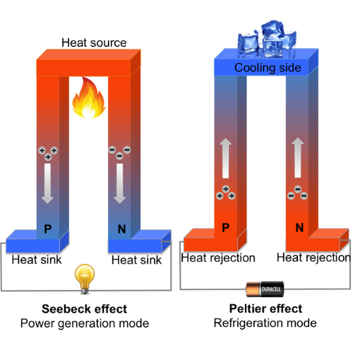
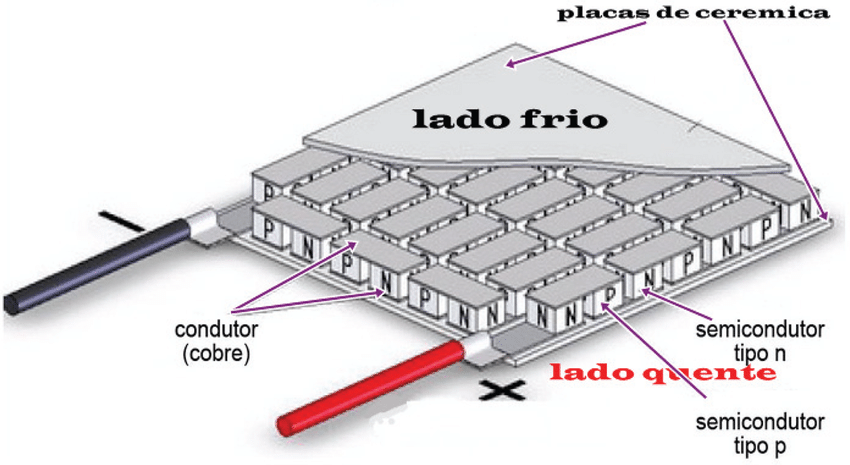
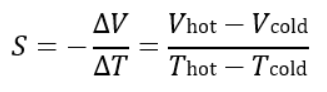

# 🌱⚡ Global Solution Green Energy 

## 👨🏻‍💻 Equipe:
- Diogo Leles Franciulli, RM558487
- Felipe Sousa de Oliveira, RM559085
- Ryan Brito Pereira Ramos, RM554497

 
 
 

## 👨🏻‍🏫 Professor: 
- Paulo Marcotti, PF2150

# ♻️ SamepyEco: Gerador Termoelétrico Sustentável 

## 📜 Descrição

O SamepyEco é uma solução inovadora e sustentável que utiliza o calor gerado pelos raios solares para produzir energia elétrica de maneira eficiente e ecológica. Nosso sistema termoelétrico aproveita a diferença de temperatura entre dois reservatórios (um de água quente e outro de água fria) para gerar eletricidade, eliminando a necessidade de combustíveis fósseis. O SamepyEco foi projetado para atender tanto áreas remotas, que frequentemente sofrem com falta de acesso a fontes confiáveis de energia, quanto indústrias que desejam reduzir seu desperdício energético e custo operacional. Nosso objetivo é contribuir para o uso consciente de recursos naturais, promovendo a preservação ambiental e a sustentabilidade energética.

A ideia da geração de energia termoelétrica sustentável surgiu a partir do tema proposto pelo Global Solution: encontrar maneiras de gerar energia limpa e eficiente enquanto aproveitamos recursos disponíveis de maneira sustentável. A inspiração para o projeto veio ao observar fontes de calor "desperdiçadas" no ambiente, como o calor produzido por águas termais, processos industriais, aquecimento solar, e até mesmo o calor dissipado em equipamentos eletrônicos. Nossa visão foi transformar esse calor não aproveitado em eletricidade, utilizando uma solução compacta, acessível e sustentável.

A pastilha de Peltier foi escolhida como a tecnologia central do projeto devido à sua capacidade de converter diferenças de temperatura diretamente em energia elétrica. Isso, aliado à possibilidade de escalabilidade em aplicações como sistemas solares, termas, indústrias, ou até residências, tornou o conceito especialmente relevante no contexto de preservação ambiental e sustentabilidade energética.

## 🌡️❄️ Como Funciona a Geração de Energia com a Pastilha de Peltier? 
A pastilha de Peltier (ou módulo termoelétrico) é um dispositivo que pode funcionar de duas maneiras:

- **Gerador Termoelétrico (Modo Seebeck):**
Quando há uma diferença de temperatura (Δ𝑇) entre suas faces, a pastilha converte esse gradiente térmico em energia elétrica, gerando uma tensão proporcional à diferença de temperatura. Este fenômeno é utilizado em aplicações de geração de energia a partir de calor residual.
- **Bomba de Calor (Modo Peltier):**
Ao aplicar uma corrente elétrica, o módulo transfere calor de uma face para a outra, criando uma diferença de temperatura. Essa propriedade é utilizada para aquecer ou resfriar superfícies, sendo comum em sistemas de refrigeração compactos (como bebedouros ou purificadores de água).

 

_Em ambas as funções, a eficiência da pastilha depende das propriedades termoelétricas dos materiais utilizados e do coeficiente de Seebeck, que mede a relação entre a diferença de temperatura e a tensão gerada._
 

No nosso projeto, a pastilha funciona no **modo Seebeck**. A pastilha é composta por dois tipos de semicondutores, chamados N-type (rico em elétrons) e P-type (pobre em elétrons). Quando uma das superfícies da pastilha é aquecida (e a outra permanece fria), cria-se uma diferença de temperatura (ΔT). Essa diferença de temperatura provoca um movimento de elétrons através dos semicondutores, gerando uma corrente elétrica. Esse fenômeno é conhecido como efeito Seebeck.

No caso do nosso projeto, o calor gerado por águas aquecidas (como em fontes termais ou reservatórios aquecidos pelo sol) aquece um lado da pastilha, enquanto o outro lado é resfriado por água fria ou em temperatura ambiente (como em um reservatório isolado ou refrigerado).
A diferença de temperatura gera eletricidade, que pode ser armazenada em baterias ou usada diretamente para alimentar dispositivos.

 

## O que é o Coeficiente Seebeck? 🧮
O coeficiente Seebeck é uma propriedade intrínseca dos materiais termoelétricos, que determina a eficiência com que eles convertem uma diferença de temperatura em energia elétrica. Ele é medido em **microvolts por kelvin (µV/K)** e representa a tensão elétrica gerada por cada unidade de diferença de temperatura entre os dois lados do material.

### Matematicamente, a tensão gerada (V) pela pastilha de Peltier pode ser expressa como:

### Onde:
- S é o coeficiente Seebeck.
- ΔT é a diferença de temperatura entre os dois lados da pastilha.

Quanto maior o coeficiente Seebeck de um material, mais eficiente ele será na conversão de calor em eletricidade. Por isso, materiais avançados como ligas de bismuto-telúrio são frequentemente usados em módulos Peltier de alta eficiência.

## 

## 📁 Estrutura de pastas

Dentre os arquivos e pastas presentes na raiz do projeto, definem-se:

- <b>.github</b>: Nesta pasta ficarão os arquivos de configuração específicos do GitHub que ajudam a gerenciar e automatizar processos no repositório.

- <b>assets</b>: aqui estão os arquivos relacionados a elementos não-estruturados deste repositório, como imagens.

- <b>config</b>: Posicione aqui arquivos de configuração que são usados para definir parâmetros e ajustes do projeto.

- <b>document</b>: aqui estão todos os documentos do projeto que as atividades poderão pedir. Na subpasta "other", adicione documentos complementares e menos importantes.

- <b>scripts</b>: Posicione aqui scripts auxiliares para tarefas específicas do seu projeto. Exemplo: deploy, migrações de banco de dados, backups.

- <b>src</b>: Todo o código fonte criado para o desenvolvimento do projeto ao longo das 7 fases.

- <b>README.md</b>: arquivo que serve como guia e explicação geral sobre o projeto (o mesmo que você está lendo agora).

## 🔧 Como executar o código

*Acrescentar as informações necessárias sobre pré-requisitos (IDEs, serviços, bibliotecas etc.) e instalação básica do projeto, descrevendo eventuais versões utilizadas. Colocar um passo a passo de como o leitor pode baixar o seu código e executá-lo a partir de sua máquina ou seu repositório. Considere a explicação organizada em fase.*

## 🗃 Histórico de lançamentos

* 0.5.0 - XX/XX/2024
 * 
* 0.4.0 - XX/XX/2024
 * 
* 0.3.0 - XX/XX/2024
 * 
* 0.2.0 - XX/XX/2024
 * 
* 0.1.0 - XX/XX/2024
 *

## 📋 Licença

<a property="dct:title" rel="cc:attributionURL" href="https://github.com/agodoi/template">MODELO GIT FIAP</a> por <a rel="cc:attributionURL dct:creator" property="cc:attributionName" href="https://fiap.com.br">Fiap</a> está licenciado sobre <a href="http://creativecommons.org/licenses/by/4.0/?ref=chooser-v1" target="_blank" rel="license noopener noreferrer" style="display:inline-block;">Attribution 4.0 International</a>.

