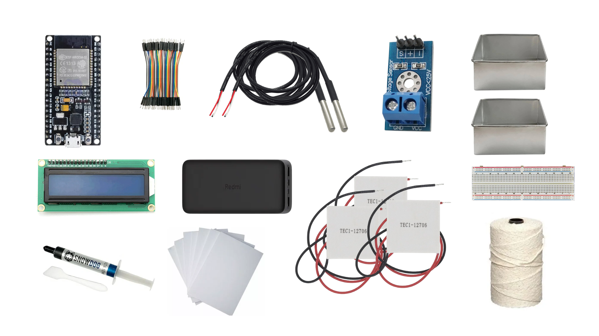
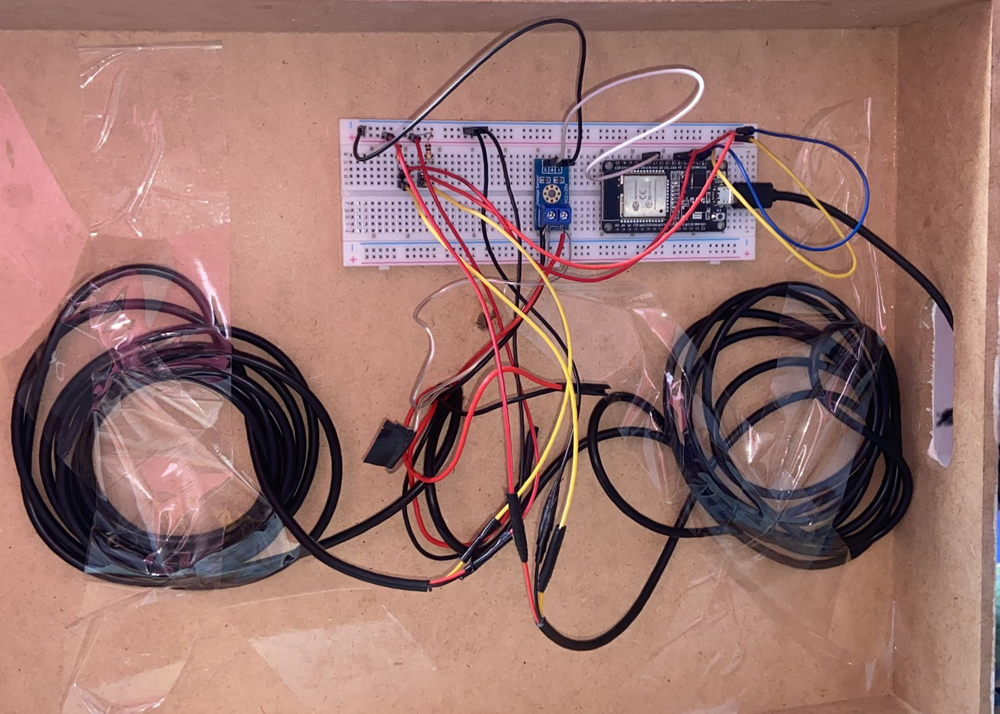
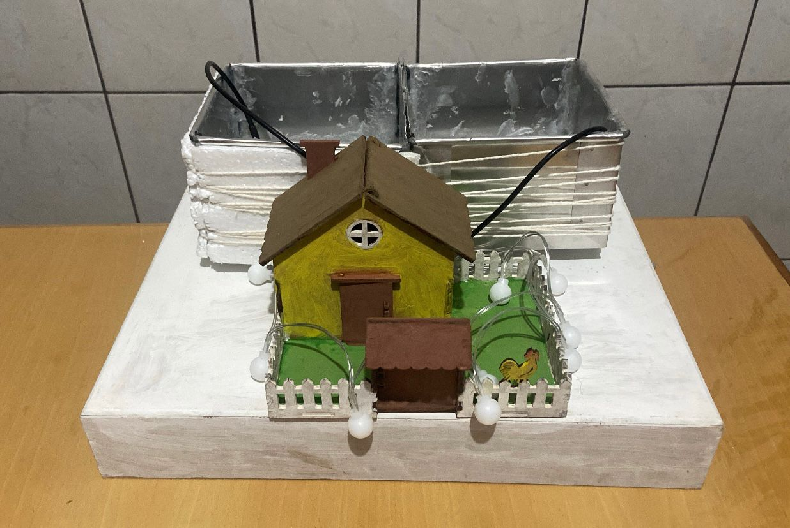
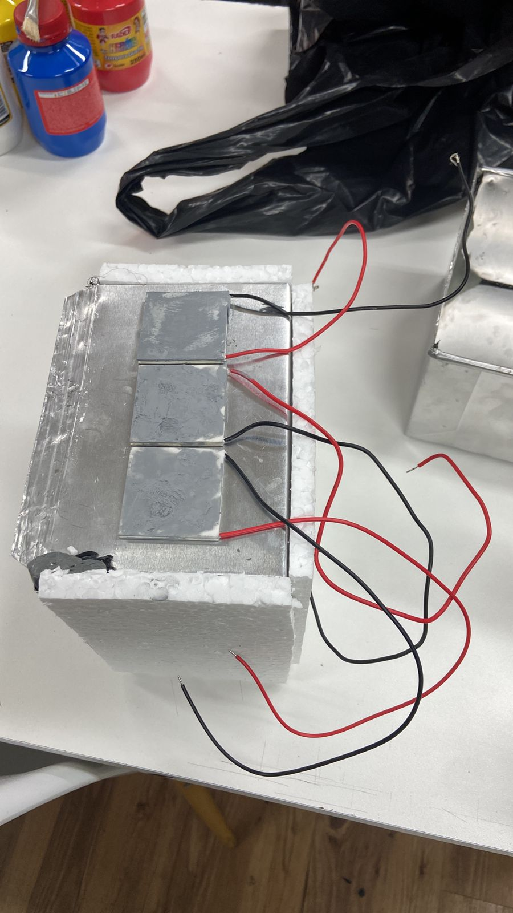
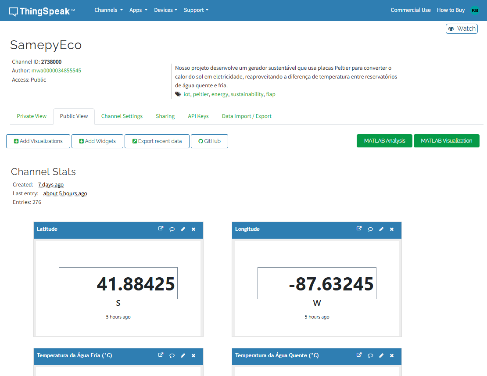
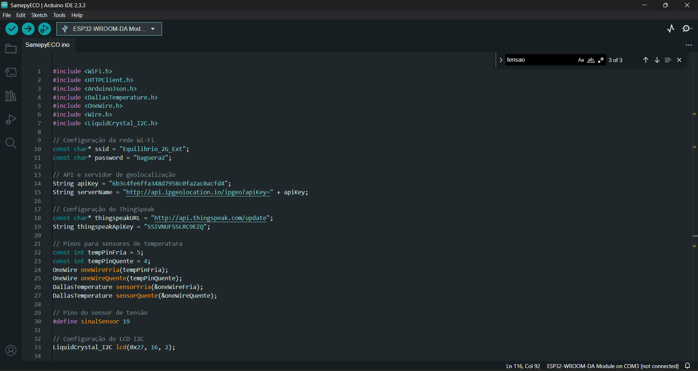
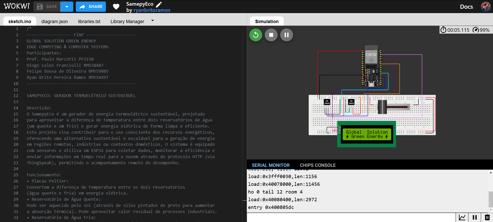

# 🌱⚡ Global Solution Green Energy 

<p align="center">
<a href=""></a>
<a href="https://www.fiap.com.br/graduacao/global-solution/"></a>
</p>

## 👨🏻‍💻 Equipe:
- Diogo Leles Franciulli, RM558487
- Felipe Sousa de Oliveira, RM559085
- Ryan Brito Pereira Ramos, RM554497
<div style="display: flex;">
 <a href="https://www.linkedin.com/in/diogo-leles-franciulli/"></a>
 <a href="https://www.linkedin.com/in/ulipese/"></a>
 <a href="https://www.linkedin.com/in/ryanbritodev"></a>
</div>

## 👨🏻‍🏫 Professor: 
- Paulo Marcotti, PF2150
<div style="display: flex;">
<a href="https://www.linkedin.com/in/pmarcotti/"></a>
</div>

# ♻️ SamepyEco: Gerador Termoelétrico Sustentável 

## 📜 Descrição

O SamepyEco é uma solução inovadora e sustentável que utiliza o calor gerado pelos raios solares para produzir energia elétrica de maneira eficiente e ecológica. Nosso sistema termoelétrico aproveita a diferença de temperatura entre dois reservatórios (um de água quente e outro de água fria) para gerar eletricidade, eliminando a necessidade de combustíveis fósseis. O SamepyEco foi projetado para atender tanto áreas remotas, que frequentemente sofrem com falta de acesso a fontes confiáveis de energia, quanto indústrias que desejam reduzir seu desperdício energético e custo operacional. Nosso objetivo é contribuir para o uso consciente de recursos naturais, promovendo a preservação ambiental e a sustentabilidade energética.

A ideia da geração de energia termoelétrica sustentável surgiu a partir do tema proposto pelo Global Solution: encontrar maneiras de gerar energia limpa e eficiente enquanto aproveitamos recursos disponíveis de maneira sustentável. A inspiração para o projeto veio ao observar fontes de calor "desperdiçadas" no ambiente, como o calor produzido por águas termais, processos industriais, aquecimento solar, e até mesmo o calor dissipado em equipamentos eletrônicos. Nossa visão foi transformar esse calor não aproveitado em eletricidade, utilizando uma solução compacta, acessível e sustentável.

A pastilha de Peltier foi escolhida como a tecnologia central do projeto devido à sua capacidade de converter diferenças de temperatura diretamente em energia elétrica. Isso, aliado à possibilidade de escalabilidade em aplicações como sistemas solares, termas, indústrias, ou até residências, tornou o conceito especialmente relevante no contexto de preservação ambiental e sustentabilidade energética.

## 🍃 Impacto Positivo
O SamepyEco promove uma energia mais limpa e sustentável, ajudando a reduzir a dependência de combustíveis fósseis e diminuindo emissões de CO₂. Ele pode beneficiar:

- **Comunidades Remotas:** Proporcionando energia onde redes elétricas não alcançam.
- **Indústrias:** Reaproveitando calor residual, reduzindo custos operacionais.
- **Meio Ambiente:** Mitigando os efeitos das mudanças climáticas ao fomentar o uso de fontes renováveis.

## 📈 Escalabilidade
O SamepyEco pode ser aplicado em diferentes contextos:

- **Doméstico:** Pequenos sistemas para residências.
- **Industrial:** Grandes instalações para recuperação de calor residual.
- **Rural:** Estações de geração de energia em regiões remotas, usando calor solar.


## 🌡️❄️ Como Funciona a Geração de Energia com a Pastilha de Peltier? 
A pastilha de Peltier (ou módulo termoelétrico) é um dispositivo que pode funcionar de duas maneiras:

- **Gerador Termoelétrico (Modo Seebeck):**
Quando há uma diferença de temperatura (Δ𝑇) entre suas faces, a pastilha converte esse gradiente térmico em energia elétrica, gerando uma tensão proporcional à diferença de temperatura. Este fenômeno é utilizado em aplicações de geração de energia a partir de calor residual.
- **Bomba de Calor (Modo Peltier):**
Ao aplicar uma corrente elétrica, o módulo transfere calor de uma face para a outra, criando uma diferença de temperatura. Essa propriedade é utilizada para aquecer ou resfriar superfícies, sendo comum em sistemas de refrigeração compactos (como bebedouros ou purificadores de água).

<br>


_Em ambas as funções, a eficiência da pastilha depende das propriedades termoelétricas dos materiais utilizados e do coeficiente de Seebeck, que mede a relação entre a diferença de temperatura e a tensão gerada._
<br>

No nosso projeto, a pastilha funciona no **modo Seebeck**. A pastilha é composta por dois tipos de semicondutores, chamados N-type (rico em elétrons) e P-type (pobre em elétrons). Quando uma das superfícies da pastilha é aquecida (e a outra permanece fria), cria-se uma diferença de temperatura (ΔT). Essa diferença de temperatura provoca um movimento de elétrons através dos semicondutores, gerando uma corrente elétrica. Esse fenômeno é conhecido como efeito Seebeck.

No caso do nosso projeto, o calor gerado por águas aquecidas (como em fontes termais ou reservatórios aquecidos pelo sol) aquece um lado da pastilha, enquanto o outro lado é resfriado por água fria ou em temperatura ambiente (como em um reservatório isolado ou refrigerado).
A diferença de temperatura gera eletricidade, que pode ser armazenada em baterias ou usada diretamente para alimentar dispositivos.

<br>


## 🧮 O que é o Coeficiente Seebeck?
O coeficiente Seebeck é uma propriedade intrínseca dos materiais termoelétricos, que determina a eficiência com que eles convertem uma diferença de temperatura em energia elétrica. Ele é medido em **microvolts por kelvin (µV/K)** e representa a tensão elétrica gerada por cada unidade de diferença de temperatura entre os dois lados do material.

### Matematicamente, a tensão gerada (V) pela pastilha de Peltier pode ser expressa como:


### Onde:
- S é o coeficiente Seebeck.
- ΔT é a diferença de temperatura entre os dois lados da pastilha.

Quanto maior o coeficiente Seebeck de um material, mais eficiente ele será na conversão de calor em eletricidade. Por isso, materiais avançados como ligas de bismuto-telúrio são frequentemente usados em módulos Peltier de alta eficiência.

## 🔌 Componentes


- 1 ESP32
- 1 Protoboard
- 3 Pastilhas Peltiers TEC1-12706
- 2 Sensores Encapsulados de Temperatura DS18B20
- 1 Sensor de Tensão DC 0-25V
- 1 Display LCD I2C
- 2 Recipientes de Alumínio
- 1 Pasta Térmica
- 1 Rolo de Barbante
- 1 Placa de Isopor
- 1 Power Bank
- Jumper Cables

### Todos os componentes eletrônicos foram adquiridos na loja de eletrônicos [Saravati](https://www.saravati.com.br/), localizada na Rua Vitória Número 39, no Bairro da Santa Ifigênia em São Paulo. Gostaríamos de agradecer a equipe da Saravati pelo rápido atendimento e pelo desconto especial oferecido aos alunos da FIAP 😄


## ⚒️ Montagem
<div>
 
 
 
</div>

<br>

Criamos um protótipo que demonstra como a energia pode ser gerada de forma sustentável utilizando o diferencial de temperatura. O sistema utiliza as pastilhas Peltier posicionadas entre os dois recipientes (formas de bolo feitas de alumínio): um com água quente e outro com água fria. O calor da água quente aquece um lado das pastilhas, enquanto a água fria resfria o outro, criando um gradiente térmico que gera energia elétrica (entre os recipientes, utilizamos uma pasta térmica que auxilia na troca de calor). No protótipo, essa energia é usada para alimentar um pisca-pisca instalado na cerca de uma casinha, ilustrando o funcionamento do sistema de forma prática. Para criar o monitoramento, utilizamos um ESP32 abastecido por um Power Bank, que registra as temperaturas dos recipientes com sensores DS18B20 e mede a tensão gerada por meio de um sensor DC 0-25V. Os dados são exibidos em tempo real em um display LCD e enviados através do protocolo HTTP ao ThingSpeak, permitindo acompanhar a eficiência do sistema em tempo real enquanto ele funciona.

## 📊 Canal de Processamento de Dados no Thingspeak
<div>
 
 
</div>
Nosso sistema integra o monitoramento local com o envio de dados para a plataforma oficial da Samepy utilizando o ESP32 e o ThingSpeak. Esses dados são coletados, tratados e enviados para análise e acompanhamento remoto:

### Coleta de Dados
#### Dados de Localização:
- Os dados de latitude, longitude, cidade e país são capturados utilizando a API da [ipgeolocation.io](https://ipgeolocation.io/). Essa API utiliza informações da rede Wi-Fi conectada ao ESP32 para determinar a localização geográfica do dispositivo, eliminando a necessidade de sensores GPS adicionais.


#### Temperaturas da Água:
- As temperaturas do lado frio e do lado quente das pastilhas Peltier são monitoradas por sensores de temperatura DS18B20. Esses dados são lidos pelo ESP32 em tempo real para avaliar a diferença térmica (ΔT) no sistema.

#### Tensão Gerada:
- O sensor de tensão DC 0-25V mede a energia elétrica gerada pelas pastilhas. Esse valor também é processado pelo ESP32.

## 🔗 Canal e Fields
### [Canal SamepyEco no Thingspeak](https://thingspeak.mathworks.com/channels/2738000)
- Field 1: Latitude
- Field 2: Longitude
- Field 3: Cidade
- Field 4: País
- Field 5: Temperatura (Água Fria)
- Field 6: Temperatura (Água Quente)
- Field 7: Tensão

## 📁 Dependências



Para executar o código do sistema SamepyEco no ESP32 utilizando a Arduino IDE, é necessário instalar e incluir uma série de bibliotecas que fornecem suporte para conexão Wi-Fi, comunicação com APIs, manipulação de sensores, exibição de dados em displays LCD e tratamento de dados JSON. Abaixo estão listadas as dependências necessárias:

- WiFi (<WiFi.h>)
- HTTPClient (<HTTPClient.h>)
- ArduinoJson (<ArduinoJson.h>)
- OneWire (<OneWire.h>)
- DallasTemperature (<DallasTemperature.h>)
- Wire (<Wire.h>)
- LiquidCrystal I2C (<LiquidCrystal_I2C.h>)

Dentro do Arduino IDE, navegue entres os menus:
**Sketch → Incluir Biblioteca → Gerenciar Bibliotecas....**
No gerenciador de bibliotecas, pesquise pelos nomes das dependências acima (ex.: WiFi, HTTPClient, ArduinoJson) e clique em **Instalar**!

No início do código, adicione todas as bibliotecas previamente instaladas:
```cpp
#include <WiFi.h>
#include <HTTPClient.h>
#include <ArduinoJson.h>
#include <OneWire.h>
#include <DallasTemperature.h>
#include <Wire.h>
#include <LiquidCrystal_I2C.h>
```

## 💻⚙️ Código
### [Circuito feito no Simulador Wokwi](https://wokwi.com/projects/414535310108324865)


O código principal utilizado no ESP32 foi desenvolvido em C++, e é responsável por criar o algoritmo que realiza a leitura de todos os dados, enviando através de uma conexão Wi-Fi para nuvem no Thingspeak. Aqui está o código utilizado no projeto:

```cpp
#include <WiFi.h>
#include <HTTPClient.h>
#include <ArduinoJson.h>
#include <DallasTemperature.h>
#include <OneWire.h>
#include <Wire.h>
#include <LiquidCrystal_I2C.h>

const char* ssid = "";
const char* password = "";

String apiKey = "";
String serverName = "http://api.ipgeolocation.io/ipgeo?apiKey=" + apiKey;

const char* thingspeakURL = "http://api.thingspeak.com/update";
String thingspeakApiKey = "";

const int tempPinFria = 2;
const int tempPinQuente = 4;
OneWire oneWireFria(tempPinFria);
OneWire oneWireQuente(tempPinQuente);
DallasTemperature sensorFria(&oneWireFria);
DallasTemperature sensorQuente(&oneWireQuente);

#define sinalSensor 19 

LiquidCrystal_I2C lcd(0x27, 16, 2);

byte fria[8] = { 0b01110, 0b01010, 0b01010, 0b01010, 0b10001, 0b11111, 0b11111, 0b01110 };
byte quente[8] = { 0b01110, 0b01010, 0b01110, 0b01110, 0b11111, 0b11111, 0b11111, 0b01110 };
uint8_t tensao[] = { 0x0e, 0x1b, 0x11, 0x1f, 0x1f, 0x1f, 0x1f, 0x1f };
byte raio[8] = { 0b00010, 0b00110, 0b01100, 0b11111, 0b11111, 0b00110, 0b01100, 0b01000 };
byte pin[8] = { 0b01110, 0b11111, 0b11111, 0b01110, 0b00100, 0b00100, 0b00100, 0b00100 };

void mostrarLCD(String titulo, float valor, int tipo);
void mostrarLocalizacao(String country, String city);
void enviarParaThingSpeak(float latitude, float longitude, String city, String country, float tempFria, float tempQuente, float voltage);

void setup() {
  Serial.begin(115200);

  sensorFria.begin();
  sensorQuente.begin();

  lcd.init();
  lcd.backlight();
  lcd.createChar(0, fria);
  lcd.createChar(1, quente);
  lcd.createChar(2, tensao);
  lcd.createChar(3, raio);
  lcd.createChar(4, pin);
  lcd.setCursor(0, 0);
  lcd.print("Global  Solution");
  lcd.setCursor(0, 1);
  lcd.write((byte)3);
  lcd.print(" Green Energy ");
  lcd.write((byte)3);
  delay(3000);
  lcd.clear();

  Serial.print("Conectando-se ao Wi-Fi ");
  Serial.println(ssid);
  WiFi.begin(ssid, password);
  while (WiFi.status() != WL_CONNECTED) {
    delay(500);
    Serial.print(".");
  }
  Serial.println("\nConectado ao Wi-Fi!");
}

void loop() {
  if (WiFi.status() == WL_CONNECTED) {
    HTTPClient http;

    http.begin(serverName);
    int httpResponseCode = http.GET();
    if (httpResponseCode > 0) {
      String payload = http.getString();
      StaticJsonDocument<1024> doc;
      DeserializationError error = deserializeJson(doc, payload);

      if (!error) {
        String country = doc["country_name"].as<String>();
        String city = doc["city"].as<String>();
        float latitude = doc["latitude"];
        float longitude = doc["longitude"];

        Serial.println("Dados obtidos com sucesso!");
        Serial.print("País: "); Serial.println(country);
        Serial.print("Cidade: "); Serial.println(city);
        Serial.print("Latitude: "); Serial.println(latitude, 6);
        Serial.print("Longitude: "); Serial.println(longitude, 6);

        sensorFria.requestTemperatures();
        float temperaturaFria = sensorFria.getTempCByIndex(0);
        Serial.print("Temp. Água Fria: "); Serial.println(temperaturaFria);

        sensorQuente.requestTemperatures();
        float temperaturaQuente = sensorQuente.getTempCByIndex(0);
        Serial.print("Temp. Água Quente: "); Serial.println(temperaturaQuente);

        float leituraADC = analogRead(sinalSensor);
        // Cálculo utilizado na vida real para capturar a tensão DC gerada pelas Placas Peltiers
        // float voltage = (float)analogRead(sinalSensor) / 4096 * 15 * 28205 * 1.725 / 27000;
        float voltage = leituraADC / 4095.0 * 3.3;
        Serial.print("Tensão: "); Serial.println(voltage, 2);

        mostrarLCD(" Agua Fria", temperaturaFria, 0);
        mostrarLCD(" Agua Quente", temperaturaQuente, 1);
        mostrarLCD(" Tensao", voltage, 2);
        mostrarLocalizacao(country, city);
        
        enviarParaThingSpeak(latitude, longitude, city, country, temperaturaFria, temperaturaQuente, voltage);
      } else {
        Serial.print("Erro ao processar JSON: ");
        Serial.println(error.f_str());
      }
    } else {
      Serial.print("Erro na requisição HTTP: ");
      Serial.println(httpResponseCode);
    }
    http.end();
  } else {
    Serial.println("Erro na conexão Wi-Fi");
  }
  delay(15000); 
}

void mostrarLCD(String titulo, float valor, int tipo) {
  lcd.clear();
  lcd.setCursor(0, 0);
  lcd.write((byte)tipo);  
  lcd.print(titulo);
  lcd.setCursor(0, 1);
  lcd.print("Valor: ");
  lcd.print(valor, 2);
  lcd.print(tipo == 2 ? "V" : "C");
  delay(5000);  
}

void mostrarLocalizacao(String country, String city) {
  lcd.clear();
  lcd.setCursor(0, 0);
  lcd.write((byte)4);  
  lcd.print(" ");      
  lcd.print(country);  
  lcd.setCursor(0, 1);
  lcd.print(city);     
  delay(5000);         
}

void enviarParaThingSpeak(float latitude, float longitude, String city, String country, float tempFria, float tempQuente, float voltage) {
  if (WiFi.status() == WL_CONNECTED) {
    HTTPClient http;

    city.replace(" ", "%20");
    country.replace(" ", "%20");

    String url = String(thingspeakURL) + "?api_key=" + thingspeakApiKey +
                 "&field1=" + String(latitude, 6) +
                 "&field2=" + String(longitude, 6) +
                 "&field3=" + city +
                 "&field4=" + country +
                 "&field5=" + String(tempFria, 1) +
                 "&field6=" + String(tempQuente, 1) +
                 "&field7=" + String(voltage, 2);

    http.begin(url);
    int httpResponseCode = http.GET();

    if (httpResponseCode > 0) {
      Serial.print("Dados enviados para o ThingSpeak com sucesso! Código: ");
      Serial.println(httpResponseCode);
    } else {
      Serial.print("Erro ao enviar dados para o ThingSpeak! Código: ");
      Serial.println(httpResponseCode);
    }
    http.end();
  }
}
```

## 📖 Referências:
- Como Utilizar o Sensor DS18B20 com Arduino e ESP32 – Tutorial Completo: https://www.youtube.com/watch?v=Vy650KLXIyY&t=36s
- Como utilizar Sensor de Tensão 0-25V DC e Como fazer Voltímetro com Arduino - Tutorial 50: https://www.youtube.com/watch?v=Kw7VUpQ-2vY&t=2s
- COMO GERAR ENERGIA só com água (GERADOR TERMOELÉTRICO): https://youtu.be/wLrXYMJs-q8?si=RZjFwoTbGtvumNiv
- GERADOR DE ENERGIA CASEIRO COM PASTILHAS PELTIER, EFEITO SEEBECK - PARTE 1: https://youtu.be/0HuZBaha4aI?si=aWUscF2hDZLagFlF
- Pequeno Dispositivo Para Puxar Água Acionado por Mine Gerador Termoelétrico: https://youtu.be/6PZ9-6zow2M?si=0dqdfydpMLmBOOF0


## 🫱🏻‍🫲🏻 Agradecimentos
- Gostaríamos de agradecer à **FIAP** e ao professor **Paulo Marcotti** pela oportunidade incrível de realizar esse projeto.

## 🧾 Licença
Este projeto está licenciado sob a **Licença MIT** - veja o arquivo [LICENSE](LICENSE) para mais detalhes.
